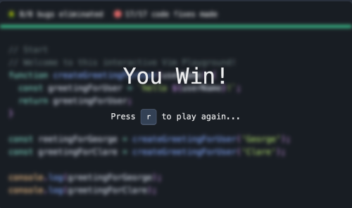

SESSION 1, 30.6.2025 
========================

## Content of the session:

* Welcome to the Study Buddies POC (theme CKAD)
    * intro, principles, concepts, difference between CKA & CKAD
    * most important hints - kubectl shortcuts, docs usage, ALIASes…

* VIM shortcuts intro

* **Application Design and Build (20%)**
    * Define, build and modify container images
    * Choose and use the right workload resource (Deployment, DaemonSet, CronJob, etc.)
    * Understand multi-container Pod design patterns (e.g. sidecar, init and others)
    * Utilize persistent and ephemeral volumes

## Concepts of the sessions in general:

This experiments theme is CKAD, the Kubernetes Application Developer certification. The sessions are designed to be interactive, with a focus on hands-on practice and real-world scenarios. Each session will cover specific topics related to the CKAD exam objectives, with a mix of theory and practical exercises.

Please bear in mind that the sessions are not a supercomplete replacement for the official training with lots of theory and deep-dive insights, but rather a practical approach to the exam objectives. The goal is to focus on the most important aspects of the exam, with providing useful resources to additional knowledge gathering and practice in YOUR free time.

### CKAD vs CKA

The CKAD (Certified Kubernetes Application Developer) certification is focused on the skills required to design, build, and run applications on Kubernetes. It emphasizes application development, deployment, and a bit of basic troubleshooting within a Kubernetes environment. The CKA (Certified Kubernetes Administrator) certification, on the other hand, is more focused on the skills required to administer and manage Kubernetes clusters.

In other words, the CKAD is more about the application side of Kubernetes, while the CKA is more about the infrastructure and operational side. The CKAD exam tests your ability to work with Kubernetes resources, understand application design patterns, and utilize Kubernetes features to build and deploy applications effectively. As a CKAD test maker, you are in the position of being a developer who just needs to make sure his or her apps run smoothly on Kubernetes, while the CKA test maker is more focused on the operational aspects of managing the Kubernetes cluster itself.

### Hints before the exam:

* Go throught the exam scenarios:
    * Killershell (available through the purchased course)
    * Killercoda scenarios for CKAD (https://killercoda.com/scenarios/ckad)

### Hints for the exam in general:

#### Time management

The exam is time-limited, so practice managing your time effectively. Use shortcuts and aliases to speed your workflow. If you get stuck on a question, move on and come back to it later if time allows. The exam environment allows you to flag the questions you want to revisit, so use that feature wisely.


I highly recommend the following ALIASes to speed up your exam flow:

```bash
export do="--dry-run=client -o yaml" # usage example: k create deploy nginx --image=nginx $do
export now="--force --grace-period 0" # usage example: k delete pod x $now
alias k=kubectl
```
* It is highly beneficial to use shortcuts for resources definitions (po, rs, sts, k...) 
```bash

k api-resources

configmaps                        cm           v1                                     true         ConfigMap
endpoints                         ep           v1                                     true         Endpoints
events                            ev           v1                                     true         Event
limitranges                       limits       v1                                     true         LimitRange
namespaces                        ns           v1                                     false        Namespace
nodes                             no           v1                                     false        Node
persistentvolumeclaims            pvc          v1                                     true         PersistentVolumeClaim
persistentvolumes                 pv           v1                                     false        PersistentVolume
pods                              po           v1                                     true         Pod
replicationcontrollers            rc           v1                                     true         ReplicationController
resourcequotas                    quota        v1                                     true         ResourceQuota
serviceaccounts                   sa           v1                                     true         ServiceAccount
customresourcedefinitions         crd,crds     apiextensions.k8s.io/v1                false        CustomResourceDefinition
daemonsets                        ds           apps/v1                                true         DaemonSet
deployments                       deploy       apps/v1                                true         Deployment
replicasets                       rs           apps/v1                                true         ReplicaSet
statefulsets                      sts          apps/v1                                true         StatefulSet
horizontalpodautoscalers          hpa          autoscaling/v2                         true         HorizontalPodAutoscaler
cronjobs                          cj           batch/v1                               true         CronJob
certificatesigningrequests        csr          certificates.k8s.io/v1                 false        CertificateSigningRequest
events                            ev           events.k8s.io/v1                       true         Event
ingresses                         ing          networking.k8s.io/v1                   true         Ingress
networkpolicies                   netpol       networking.k8s.io/v1                   true         NetworkPolicy
priorityclasses                   pc           scheduling.k8s.io/v1                   false        PriorityClass
storageclasses                    sc           storage.k8s.io/v1                      false        StorageClass
...

```
* Imperative commands is the way to go, as you will not have time to write YAML files during the exam. This is a bit different from the real world scenarios, where gitops and YAML files are the best practice.
* Docs are your friend, especially because of the example yaml files. During the exam, you can use the official Kubernetes documentation as well as Kubernetes blog although that one is not very useful.

## VIM shortcuts intro

Vim is a powerful text editor that is often used in the Kubernetes ecosystem. You will need to be familiar with basic Vim commands to navigate and edit files during the exam. 

### TASK! (#1)

For testing the shortcuts listed below, you can use any text file you have available or if you are lazy to find somathing suitable, feel free to get the dummy one prepared for you in [./task1_1/dummy_text.yaml](https://github.com/littlesvensson/sec_studybuddies/blob/main/session_1/task1_1/dummy_text.yaml).

### Basic Movement: 
**h** - left <br>
**j** - down <br>
**k** - up <br>
**l** - right <br>

Yes, it is possible to use just arrows for the time being with the same movement purpose. But the "theory" says
using them requires you to move your right hand completely away from the home row keys. This is inefficient. 
Vim is about efficiency, which means staying as close as possible to the home row keys.

### Moving with words:
**w** - next word <br>
**e** - end of word <br>
**b** - back to the beginning of the word <br>

Need to move more words or lines at once? Use numbers before the commands: <br>
**2w** - move 2 words forward <br>
**3j** - move 3 lines down <br>

### Insert Mode:
 **i** - insert before the cursor <br>
 **a** - insert after the cursor <br>

**Insert at Line Ends** <br>
**I** - insert in the beginning of line <br>
**O** - insert in the end of the line <br>

### Opening Lines: 
**o** - open a new line below the current line <br>
**O** - open a new line above the current line <br>

### Escape from insert mode:

**Esc** - going away from the current mode

### Deleting:
**x** - delete character under the cursor <br>
**dd** - delete the whole line <br>
**dw** - delete the word under the cursor <br>
**d$** - delete from the cursor to the end of the line <br>
**d^** - delete from the cursor to the beginning of the line <br>
It is possible to combine with count when deleting, as well:
**d** + number + **w / d**  - delete multiple words (e.g. **d3w or d5d**)<br>

### Copying and Pasting:
**yy** - copy the whole line <br>
**yw** - copy the word under the cursor <br>
**p** - paste after the cursor <br>
**P** - paste before the cursor <br>
**d** + number + **y** - copy multiple lines (e.g. **3 yy**) <br>

### Visual Mode:
**v** - enter visual mode to select text <br>
**V** - enter visual line mode to select whole lines <br>

### Indentation:
**>** - move indentation of selected text to the right side <br>
**shift+>** - move indentation of selected text to the left side <br>

### Undo and Redo:
 **u** - undo the last change <br> 
 **Ctrl+r** - redo the last undo <br>

### Quitting Vim: <br>
**:q** - quit <br>
**:wq** - save and quit <br>
**:x** - save and quit but better :) <br>
**:q!** - quit without saving <br>

It would be good to practice these shortcuts before the exam as much as possible to get used to them and increase your speed during editing.

And now, time for the **first game**!

GAME: [Bug Squasher](https://www.vim-hero.com/lessons/basics-review)

**How to play:**
* 1: Eliminate bugs by jumping over them with the word motions w, e, and b.
* 2: Use insert mode to restore the characters devoured by bugs.
* Time cap: 5 minutes

If you win within the time cap, send a screenshot of your winning screen to the chat to share the joy with others!



### Additional sources (#1)
* Vimtutor - just write 'vimtutor' in your terminal
* [ThePrimeagen](https://www.youtube.com/watch?v=X6AR2RMB5tE&t=360s) really nice intro to Vim
* Most important - practice, practice, practice on real files


## DOCKER magic

Dockerfile is a text file that contains instructions on how to build a Docker image - the blueprint for running containers. It defines the base image, the commands to run, and the files to include in the image. We need it to build our application image that we will run in Kubernetes.

There is a simple Dockerfile example in the [session_1/task1_2](https://github.com/littlesvensson/sec_studybuddies/tree/main/session_1/task1_2) directory, which you can use to build your first Docker image. The Dockerfile is a simple Python application that prints a message to the console.

```dockerfile
# Image from which we are starting
FROM python:3.13-slim

# Seting working directory
WORKDIR /app

# Copy of a beautiful script into the container
COPY miaumiau.py .
ENV IFEELLIKEA="FRISBEE"

# Running the script on container start
CMD ["python", "miaumiau.py"]
```

In the CKAD exam, it is not necessary to have too much deep knowledge of Dockerfile syntax and the docs about this topic are 
not available during the exam. It is enough to have some basic knowledge of how to build a Docker image and run it in a container.

### TASK! (#2)

* Clone the repo if you haven't done it yet
* Navigate with your terminal to the `session_1/task1_2` directory
* Make sure you have Docker or Podman installed
* How do you feel today? Change the `IFEELLIKEA` environment variable in the Dockerfile to something else than "FRISBEE" (e.g. "STUDY BUDDY", "KUBERNETES SUPERSTAR", "DOCKERNINJA", etc.)
* Build the Docker image with the command: `docker build -t ttl.sh/miaumiau<<yournickname>>:1h .`
* Run the Docker image with the command: `docker run --rm ttl.sh/miaumiau<<yournickname>>:1h`
* Push ttl.sh image registry: `docker push ttl.sh/miaumiau<<yournickname>>:1h`

If you want to list all the images you have built or pulled, you can use the command:
```bash
docker image ls
```

> Note:
> [ttl.sh](https://ttl.sh/) is a supercool, free, temporary container image registry provided by Replicated. It allows you to:
> * Push container images
> * Set a Time To Live (TTL) after which the image is automatically deleted
> * Use it without creating an account
> In other words, a beautiful tool for demos, testing and study sessions like this one!

In CKAD you might be asked to build/run/push the docker image via podman (also a container management tool). You would use the same commands as with docker, e.g. `podman build -t ttl.sh/miaumiau<<yournickname>>:1h .`

There probably won't be needed many other spacial flags for the exam. In case there will be something specific not listed here which you don't know, you can always use the `--help / -h` flag to get more information about the command and its options. For example, `docker build -h` or `podman build -h`.

### Additional sources (#2)

For additional information on Dockerfile syntax, you can refer to the [Dockerfile reference](https://docs.docker.com/reference/dockerfile/). <br>
More on building images via [docker](https://docs.docker.com/get-started/docker-concepts/building-images/) and [podman](https://docs.podman.io/en/latest/Commands.html) can be found in their respective sections. <br>
Dockerfile best practices can be found in the [Dockerfile best practices](https://docs.docker.com/develop/develop-images/dockerfile_best-practices/) documentation. <br>

### Homework! (#1) 
Killercoda will be your friend through the whole (not only) CKAD journey. Feel free to explore the scenarios dediacated to the [Dockerfile and image building.](https://killercoda.com/scenarios/dockerfile) <br>
When working on exercises, try to use at least some of the VIM shortcuts you learned in this session :)

## PODs playground

### What the hell are pods?
Pods are the smallest deployable units in Kubernetes and can contain one or more containers. These containers share the same network namespace and can communicate with each other using localhost.

The Pod resource tells Kubernetes:
* What container(s) to run (like Docker images)
* How to run them (CPU, memory, ports, etc.)
* Where they should live (on which node)
* How they connect to the network
* What to do if the container crashes*
* and more...

Kubernetes manages containers through Pods, not directly. If you run a container in Kubernetes, it always wraps it in a Pod, even if there's only one container in it. 

In most Pods, there's usually one main container, and that's the one doing the "real work" (like running your app).

>Note: *What can we "do" with resources in general?*
>
> - create
> - edit
> - describe
> - delete
> - replace
> - apply
> - scale (deployment, replicaset, statefulset)
> - rollout (deployment)
> - label
> - annotate
> - expose (pod, deployment, replicaset, statefulset)
> - logs (pods)
> - run (pods)

RUN action for pod is basically the same as CREATE action for any other resource within kubernetes

`kubectl run` was originally designed for quickly launching Pods (especially for testing)
`kubectl create` is used for creating complete, named resources (Deployments, Services, etc.) from YAML or CLI. 

Let's have a look at first at all the options we have with the RUN action for pod.
The -h flag is and will be useful many times because it shows flags we can use for the commands, their explanations and some examples. This will be useful for the exam as one cannot remember everything.

```bash
k run -h
```
For running a pod directly, we always need to have:
- image name
- pod name

```bash
k run mylovelyimage --image=nginx:latest
```

Let's try something else and add more options by using flags:

```bash
k run muuu -it --rm --restart=Never --image=wernight/funbox -- cowsay "DEVSECOPS in our hearts"
```
- **k**:	Shortcut for kubectl (you probably have alias k=kubectl)
- **run muuu**:	Creates a Pod named muuu
- **-i**:	Interactive mode — keep STDIN open (needed if you're typing input)
- **-t**:	Allocate a TTY — required for a proper terminal UI (makes output readable like a terminal)
- **--rm**:	Delete the Pod automatically when it exits
- **--restart=Never**:	Run this as a single-run Pod, not a Deployment or Job
- **--image=...**:	Specifies which container image to use (wernight/funbox)
- **--**:	Marks the end of flags — everything after goes to the container
- **cowsay "..."**:	This is the command run inside the container 

### TASK! (#3)

Create and run a temporary Kubernetes pod that:

* Uses the wernight/funbox container image
* Name of the pod is meowmaster
* Runs the `nyancat` command
* Launches in **interactive mode**
* Removes itself up automatically after exit (no leftover pod)

Time CAP: 5 minutes

Stuck on the way? Use the command from [this file](https://github.com/littlesvensson/sec_studybuddies/blob/main/session_1/task1_3/solution.md) as a reference.

#### Editing the resource - live and from yaml
If you want to edit a resource, you can use the `k edit` command. This will open the resource in your default editor (usually Vim or Nano) and allow you to make changes directly.

```bash
k edit <<resource type>> <<pod name>>
```

When editing resources like this, it is necessary to delete some fields that are not editable, such as `status`, `metadata.creationTimestamp`, and `metadata.resourceVersion`. If you don't delete these fields, the command will fail with an error message. With pods it is not so easy, they are kind of immutable, so you will need to delete the pod and create a new one with the updated configuration otherwise you will get error. Luckily we have also declarative approach, which is more suitable for editing resources.

### Imperative vs declarative approach

During the exam, you will mostly use the imperative approach, which means you will use commands to create and manage resources directly. This is different from the declarative approach, where you define resources in YAML files and apply them using `kubectl apply`. Often, you will need to use the `--dry-run=client -o yaml` option to generate the YAML manifest of the resource you are creating, tweak it a bit and then apply it using `kubectl apply -f <file.yaml>`.

### TASK! (#4)
* create a pod with name 'juchjuch' and image 'nginx:latest'
* edit the pod and change the image to 'nginx:1.23'

Hint: `k get <<resource type>> <<pod name>> -o yaml > <<name your file to edit>>.yaml` will give you the YAML manifest of the pod, which you can use to edit the pod. You can also use the `--dry-run=client -o yaml` option to generate the YAML manifest of the resource you are creating, tweak it a bit and then apply it using `kubectl apply -f <file.yaml>`.

Time CAP: 5 minutes

Try to use some of the VIM shorcuts you learned in this session, such as `i` to enter insert mode, `x` to delete characters, and `dd` to delete lines.

#### Useful commands for getting information about Pods

**k get po**:	List all Pods in the current namespace <br>
**k get po <pod name> -o wide**:  Get more details about the Pod (node, IP, etc.) <br>
**k describe po <pod name>**:	Detailed info about the Pod (events, conditions, etc.) <br>
**k get po <pod name> -o yaml**:	Get full YAML manifest of the Pod <br>
**k logs po <pod name>**:  Get logs from the Pod's main container <br>
**k logs po <pod name> -c <container name>**:  Get logs from a specific container in the Pod <br>

### Multi-container Pod design patterns (e.g. sidecar, init and others)

If there are multiple containers in a Pod?
They:
* Run on the same node
* Share the same IP address
* Can talk to each other using localhost
* Can share storage/volumes
* Are co-located and scheduled together

This is great for helper containers, like:

* A web server + a log collector
* A main app + a sidecar

In Kubernetes, a Pod is the smallest deployable unit and can host one or more containers that:

You use multi-container Pods when containers need to work closely together, often in tightly-coupled roles.

1. Sidecar Pattern
**Purpose**: Add capabilities to the main container
**Typical Use Case**: Log shipping, proxying, configuration reloaders
**Example**: A web server (main container) + a Fluentd container (sidecar) to forward logs.

```yaml
containers:
- name: app
  image: my-app
- name: fluentd
  image: fluentd
  volumeMounts:
  - name: logs
    mountPath: /var/log/app
```

2. Init Container Pattern
**Purpose**: Run setup logic before main containers start
**Typical Use Case**: Downloading code, waiting for dependencies, setting up databases
**Key Feature**: They always run sequentially and must complete successfully before main containers start.

```yaml
initContainers:
- name: init-db
  image: busybox
  command: ['sh', '-c', 'until nc -z db 5432; do sleep 2; done']
```

Lets have a look what documentation examples show regarding the topic:
* [PODs in general](https://kubernetes.io/docs/concepts/workloads/pods/)
* [init containers](https://kubernetes.io/docs/concepts/workloads/pods/init-containers/)
* [sidecar containers](https://kubernetes.io/docs/concepts/workloads/pods/sidecar-containers/)

In the exam, there is a high chance that you will need to create a workload resource (like Deployment, DaemonSet, or CronJob) that uses multi-container Pods. You will need to understand how to define the containers, their images, and how they interact with each other. This is something you cannot do just with the `kubectl run` command, as it is not suitable for creating complex resources with multiple containers.

Instead, you will need to use the `kubectl create` / `kubectl apply` command with help of the `--dry-run=client -o yaml` option to generate the YAML manifest of the resource you are creating, tweak it a bit and then apply it using `kubectl apply -f <file.yaml>` or just by tweaking the YAML copied from the docs.

### TASK! (#5)

Create a Pod with Init, Main, and Sidecar Containers 

1. Init Container
Container name: waiter
Image: busybox:1.28
Command: Simulate a wait using: ['sh', '-c', 'echo "Initializing..." && sleep 5']

2. Main Container
Name: president
Image: nginx:1.25

3. Sidecar Container
Name: heartbeat
Image: busybox
Command: Print a heartbeat message every 10 seconds: ['sh', '-c', 'while true; do echo "Sidecar alive at $(date)"; sleep 10; done']

Time CAP: 5 minutes

Hint: Kubernetes docs is your friend. Try to find a similar example and change the values appropriately. Ideally search for it yourself to get used to navigating the site, otherwise if struggling, for example [Example application](https://kubernetes.io/docs/concepts/workloads/pods/sidecar-containers/#sidecar-example) from the Sidecar Containers section could be a good base.


Stuck on the way? No worries, you can check the solution in the [./task1_5/solution1_5.md](https://github.com/littlesvensson/sec_studybuddies/blob/main/session_1/task1_5/solution.md) file.


That would be it for the first STUDYBUDDIES SESSION! 
I hope you enjoyed it, please let me know your feedback and any improvement suggestions, this should help us all with preparation and the right feedback would make this serie more efficient.
