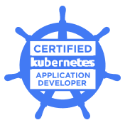

(FINAL) SESSION 10, 21.7.2025 
========================

* Network Policies
* Helm  
* Kustomize
* Last Tips 


## Network Policies pt. 2

To understan Network Policies OR/AND syntax better, I highly recommend experimenting with the [Network Policy Editor by Isovalent] (https://editor.networkpolicy.io/). Just make sure to play within the Kubernetes Network Policy Tab and not the Cilium Network Policy Tab.

### TASK! (#1)

For the following task, please use the [Killercoda playground](https://killercoda.com/playgrounds/scenario/kubernetes), as with Kind we do not have any CNI for NetworkPolicies in place.

- Create a new namespace called mystery.
- In the folder [task10_1](task10_1), you have manifest definitions for two Deployments, one Service and a NetworkPolicy. Apply them to the `mystery` namespace.
- It seems something is wrong with this setup. Why? Try to fix the issue by **keeping NetworkPolicy without changes**. You can check if the change is or is not working by running the following commands:

```bash
k exec -n mystery deploy/frontend -- curl backend
```

## Helm

Helm is a Kubernetes package manager that simplifies deploying, upgrading, and managing applications using reusable, versioned templates called charts. When installing complex applications, Helm charts can save you a lot of time and effort because instead of writing all the YAML files yourself, you can use a pre-defined chart that contains all the necessary configurations and in case you need to change something, you can do it with a single command or by modifying a values file.

You should know how to use Helm to deploy applications, but only at a **basic user level**.

#### Add a Helm Repository to your local Helm client
```bash
helm repo add <name it how you like> <repository URL>


helm repo add bitnami https://charts.bitnami.com/bitnami
```

#### Update the Helm repo with the latest charts:
```bash
helm repo update
```

#### Have a look at the available charts
```bash
helm search repo <chart name>

helm search repo bitnami

helm search repo bitnami/postgresql --versions
```

#### Install a Chart to create a release
```bash
helm install <release name> <chart name>
helm install <release name> <chart name> --version <chart version>
```

#### Upgrade a Release
```bash
helm upgrade <release> <chart> 
```

#### Upgrade a Release with custom values
```bash
helm upgrade <release> <chart> --set replicaCount=3
```

```bash
helm show values <chart>
```

#### Uninstall a Release
```bash
helm uninstall <release name>
```

#### View Installed Releases
```bash
helm list
helm list --all-namespaces
helm list -n <namespace>
```

### TASK! (#2)

- create a new namespace called `ingress`
- in the newly created namespace, install the Bitnami NGINX Helm chart. The url to the chart is https://charts.bitnami.com/bitnami. Use the latest version of the chart.
- name the release ingressmagic

## Kustomize

In Kubernetes, you often have many YAML files. If you need different setups for dev, staging, or prod, copying and editing files can get messy. Kustomize helps you manage this complexity.

With Kustomize, you:
* Reuse a base configuration
* Apply different overlays (patches) for each environment
* Avoid duplicating files


Kustomize is a tool built into kubectl (kubectl apply -k) for customizing Kubernetes YAML without modifying the originals. You should know how to use it, but only at a practical, basic level. You're not expected to master advanced overlays or plugin systems.

It works by combining base YAML files and applying patches, name prefixes, labels, etc.

```bash
kubectl apply -k <directory>
kubectl apply -k overlays/dev/
This tells kubectl to look for a kustomization.yaml file in that directory and apply the combined resources.
```

#### Basic Concepts 

- **Base**: The original YAML files you want to customize.
- **Overlay**: A directory that contains a kustomization.yaml file, which specifies how to modify the base files.
- **kustomization.yaml**: A file that defines how to customize the base files. It can include resources, patches, name prefixes, labels, and more.

#### What CKAD Might Ask You to Do
- apply a Kustomization file

#### What You Do Not Need to Know
- No need for advanced overlays or generators
- No need to write strategic merge patches or JSON6902 patches
- No need to install Kustomize separately (it's built into kubectl)

```bash
k apply -k overlays/dev/
```

### TASK! (#3)

There is a folder called [kustomize-example](./kustomize-example/) inspired by [similar kustomize structure by viadee](https://github.com/viadee/kustomize-examples/tree/master). It contains a base configuration and overlays for dev and prod environments.
Apply the Kustomization for the prod environment in the folder [kustomize-example](./kustomize-example/). Create a new namespace if needed.

## Last Tips

### 1. Get a big screen

### 2. Ensure you have a good internet connection

### 3. Work with time wisely

### 4. Read the questions carefully

### 5. Go through Killercoda and Killershell scenarios

### 6. Dont forget VIM has shortcuts :)

### 7. Use shortcuts and imperative commands

### 8. Be patient with the proctors and be ready they check everything


> Notes/Miscellanious: LimitRange and RequestQuota were showed by me in the session as a bonus only, but beware - its there! Luckily its supereasy to edit them, just make sure you are aware that resource types like these do exist.

> Notes/Miscellanious2: There is something like PAUSED DEPLOYMENT! And it might be used in an exam. 

```bash
k rollout pause deployment my-app
k set image deployment my-app my-container=my-image:v2
k rollout resume deployment my-app
```

## MOTIVATION!



## Wrap up

WE MADE IT!!!!!

By know, we have covered all the topics that are needed for the CKAD exam. I hope you enjoyed the sessions and learned a lot. <br>
If you have any questions, please do not hesitate to reach out to me. Also, if you have any feedback or suggestions for improvements when it comes to the learning session, please let me know. The goal is that people learn, enjoy it, and ideally have also some fun while doing so.

Cheers,

Jaja