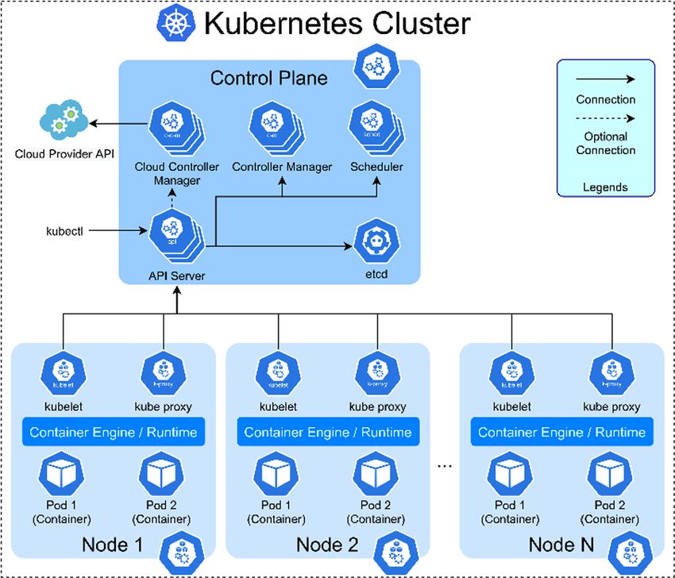
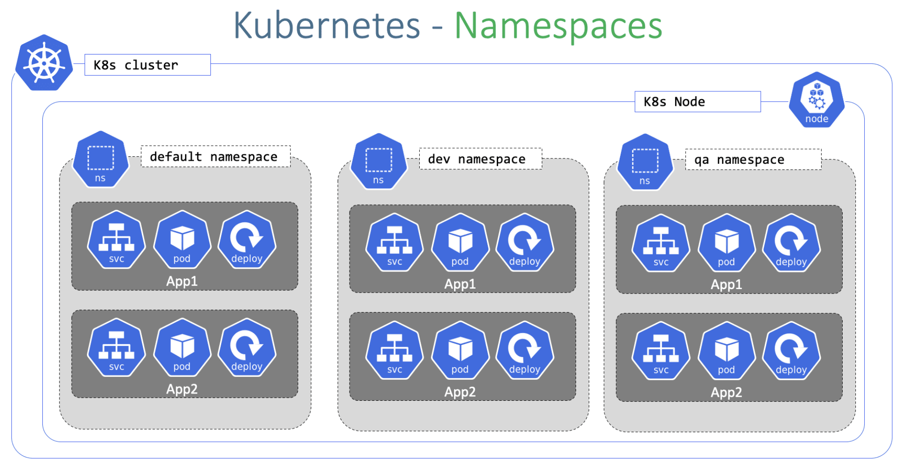

SESSION 2, 2.7.2025 
========================

## Content of the session:

* Learn about Kubernetes cluster, nodes and namespaces

**Application Design and Build**
* Choose and use the right workload resource \
  * Deployment
  * ReplicaSet
  * DaemonSet
  * StatefulSet
  * Job
  * Cronjob

**Application Observability and Maintenance**
* Understand API deprecations
* Implement probes and health checks

**Application Deployment**
* Understand Deployments and how to perform rolling updates
* Implement probes and health checks

**Application Environment, Configuration and Security**
* Understand ConfigMaps
* Understand Secrets

**wrap up, homework, next steps**

#### Editing the resource - live and from yaml
If you want to edit a resource, you can use the `k edit` command. This will open the resource in your default editor (usually Vim or Nano) and allow you to make changes directly.

```bash
k edit <resource type> <pod name> 
```

When editing resources like this, it is necessary to delete some fields that are not editable, such as `status`, `metadata.creationTimestamp`, and `metadata.resourceVersion`. If you don't delete these fields, the command will fail with an error message. With pods it is not so easy, they are kind of immutable, so you will need to delete the pod and create a new one with the updated configuration otherwise you will get error. Luckily we have also declarative approach, which is more suitable for editing resources.

### Imperative vs declarative approach

During the exam, you will mostly use the imperative approach, which means you will use commands to create and manage resources directly. This is different from the declarative approach, where you define resources in YAML files and apply them using `kubectl apply`. Often, you will need to use the `--dry-run=client -o yaml` option to generate the YAML manifest of the resource you are creating, tweak it a bit and then apply it using `kubectl apply -f <file.yaml>`. Or you will get the yaml manifest of the resource you want to edit by `k get <resource type> <<resource name>> -o yaml > <name your file to edit>.yaml` and then edit it in your favorite editor (e.g. Vim) and apply it using `kubectl apply -f <file name>.yaml`.

### TASK! (#4)
* create a pod with name 'juchjuch' and image 'nginx:latest'
* edit the pod and change the image to 'nginx:1.23'

Hint: `k get <<resource type>> <<pod name>> -o yaml > <<name your file to edit>>.yaml` will give you the YAML manifest of the pod, which you can use to edit the pod. 

Time CAP: 5 minutes

Try to use some of the VIM shorcuts you learned in this session, such as `i` to enter insert mode, `x` to delete characters, `dd` to delete lines...

#### Useful commands for getting information about Pods

**k get po**:	List all Pods in the current namespace <br>
**k get po <pod name> -o wide**:  Get more details about the Pod (node, IP, etc.) <br>
**k describe po <pod name>**:	Detailed info about the Pod (events, conditions, etc.) <br>
**k get po <pod name> -o yaml**:	Get full YAML manifest of the Pod <br>
**k logs po <pod name>**:  Get logs from the Pod's main container <br>
**k logs po <pod name> -c <container name>**:  Get logs from a specific container in the Pod <br>

### Multi-container Pod design patterns (e.g. sidecar, init and others)

If there are multiple containers in a Pod?
They:
* Run on the same node
* Share the same IP address
* Can talk to each other using localhost
* Can share storage/volumes
* Are co-located and scheduled together

This is great for helper containers, like:

* A web server + a log collector
* A main app + a sidecar

In Kubernetes, a Pod is the smallest deployable unit and can host one or more containers that:

You use multi-container Pods when containers need to work closely together, often in tightly-coupled roles.

#### 1. Sidecar Pattern
**Purpose**: Add capabilities to the main container <br>
**Typical Use Case**: Log shipping, proxying, configuration reloaders <br>
**Example**: A web server (main container) + a Fluentd container (sidecar) to forward logs.

```yaml
containers:
- name: app
  image: my-app
- name: fluentd
  image: fluentd
  volumeMounts:
  - name: logs
    mountPath: /var/log/app
```

#### 2. Init Container Pattern
**Purpose**: Run setup logic before main containers start <br>
**Typical Use Case**: Downloading code, waiting for dependencies, setting up databases <br>
**Key Feature**: They always run sequentially and must complete successfully before main containers start.

```yaml
initContainers:
- name: init-db
  image: busybox
  command: ['sh', '-c', 'until nc -z db 5432; do sleep 2; done']
```

Lets have a look what documentation examples show regarding the topic:
* [PODs in general](https://kubernetes.io/docs/concepts/workloads/pods/)
* [init containers](https://kubernetes.io/docs/concepts/workloads/pods/init-containers/)
* [sidecar containers](https://kubernetes.io/docs/concepts/workloads/pods/sidecar-containers/)

In the exam, there is a high chance that you will need to create a workload resource (like Deployment, DaemonSet, or CronJob) that uses multi-container Pods. You will need to understand how to define the containers, their images, and how they interact with each other. This is something you cannot do just with the `kubectl run` command, as it is not suitable for creating complex resources with multiple containers.

Instead, you will need to use the `kubectl create` / `kubectl apply` command with help of the `--dry-run=client -o yaml` option to generate the YAML manifest of the resource you are creating, tweak it a bit and then apply it using `kubectl apply -f <file.yaml>` or just by tweaking the YAML copied from the docs.

### TASK! (#5)

Create a Pod with Init, Main, and Sidecar Containers 

1. Init Container
Container name: waiter
Image: busybox
Command: Simulate a wait using: ['sh', '-c', 'echo "Initializing..." && sleep 5'] 

2. Main Container
Name: president
Image: nginx

3. Sidecar Container
Name: heartbeat
Image: busybox
Command: Print a heartbeat message every 10 seconds: ['sh', '-c', 'while true; do echo "Im still alive $(date), time to go to bed for 10 seconds!"; sleep 10; done']

Time CAP: 5 minutes

Hint: Kubernetes docs is your friend. Try to find a similar example and change the values appropriately. Ideally search for it yourself to get used to navigating the site, otherwise if struggling, for example [Example application](https://kubernetes.io/docs/concepts/workloads/pods/sidecar-containers/#sidecar-example) from the Sidecar Containers section could be a good base.

Stuck on the way? No worries, you can check the solution in the [./task1_5/solution1_5.md](./task1_5/solution.md) file.

## Kubernetes Cluster, Nodes and Namespaces

Before we will continue with the pods and their parents, let's clarify three other terms in Kubernetes: Cluster, Namespace and Node.

#### Cluster
A cluster is a set of nodes (machines) that run containerized applications. It consists of a control plane that manages the cluster and worker nodes that run the applications. The control plane makes decisions about the cluster, such as scheduling applications, maintaining their desired state, scaling them up or down, and rolling out updates.

#### Node 
A node is a physical or virtual machine that runs your application workloads. It is part of the Kubernetes cluster and hosts pods, which are the smallest deployable units in Kubernetes.


Image source: [expertflow.com](https://docs.expertflow.com/cx/4.3/kubernetes-deployment-getting-started)

#### Commands to check nodes
```bash
k get no # list nodes
k get no --show-labels # list nodes with labels
k get no -owide # list nodes with more details
k top no # show resource usage of nodes
```

> Note: If you want to get the command k top no to work, you need to have the metrics server installed in your cluster. More info for > getting this work in Kind is to be found in [metrics_server.md](https://github.com/littlesvensson/sec_studybuddies/blob/main/session_2/metrics_server.md) file. If you will need the command during the exam, metrics server would be preinstalled for you already. 

#### Namespace
A namespace is a way to divide cluster resources according to a specific logic - defined by you/admin/owner of the cluster. It acts like a virtual cluster within the Kubernetes cluster, helping organize and isolate resources (like pods, services, etc.) for different teams or projects.

 <br>
Image source: [devopssec.fr](https://www.devopssec.fr/article/environnements-ephemeres-kubernetes)

Very simply said, pods deployed within one namespace cannot access resources in another namespace unless explicitly allowed. (Depending on the cluster configuration, RBAC, Network Policies, etc.). Pods deployed in the same namespace can be from various nodes, but they can communicate with each other without any issues.

#### Basic commands for working with namespaces
```bash
k create ns <namespace name> # create namespace
k get ns # list namespaces
k get ns --show-labels # list nodes with labels
k get ns -owide # list nodes with more details
k delete ns <namespace name> # show resource usage of nodes
k edit ns <namespace name> # edit namespace
k label ns <namespace name> <label name>=<label value> # add label to namespace
k label ns <namespace name> <label name>- # remove label from namespace
```
In the exam, you will often get task in combination with a particular namespace. It is crucial not to forget to specify the namespace in your commands, otherwise you might end up creating resources in the default namespace and lose all the points for the task. 

Imperatively:
```bash
k create deploy <deployment name> --image=<image name> --replicas=<number of replicas> -n <namespace name>
```
Let's see it through manifest file:

```bash
k create deploy cutedeployment --image=nginx -n studybuddies --dry-run=client -oyaml
```

```yaml
apiVersion: apps/v1
kind: Deployment
metadata:
  creationTimestamp: null
  labels:
    app: cutedeployment
  name: cutedeployment
  namespace: studybuddies
spec:
  replicas: 1
  selector:
    matchLabels:
      app: cutedeployment
  strategy: {}
  template:
    metadata:
      creationTimestamp: null
      labels:
        app: cutedeployment
    spec:
      containers:
      - image: nginx
        name: nginx
        resources: {}
status: {}
```

### TASK! (#1)

- Create a namespace called `studybuddies`
- Label the namespace with `team=studybuddies`
- Check all namespaces and their labels `k get <resource name> --show-labels`

Time CAP: 2 minutes.
Stuck on the way? Check the solution in the [./task2_1/solution.md](./task2_1/solution.md) file.

## PODS PARENTS

Pods are the smallest deployable units in Kubernetes, but they are often managed by higher-level abstractions that provide additional features like scaling, rolling updates, and self-healing. These abstractions are known as **controllers**.

### Replicasets

A replicaset ensures that a specified number of pod replicas are running at any given time. It can be used to scale applications up or down and provides self-healing capabilities by replacing failed pods.

#### Features:
- Replication:	Maintains a stable set of running pods
- Self-healing:	Recreates pods if they crash or are deleted
- Label selector support:	Matches pods using labels to manage them
- Scaling: We can scale the number of pod replicas up or down by changing the `replicas` field in the replicaset configuration

> Note: Replicasets are most often used indirectly through Deployments, which manage the lifecycle of replicasets and provide additional features like rolling updates. Also, it is not possible to create them imperatively using `k create rs...`

```yaml
apiVersion: apps/v1
kind: ReplicaSet
metadata:
  name: mylovelyllamaset
  namespace: studybuddies
spec:
  replicas: 3
  selector:
    matchLabels:
      app: nginx
  template:
    metadata:
      labels:
        app: nginx
    spec:
      containers:
      - name: nginx
        image: nginx
```
We cannot create replicaset imperatively using `k create rs...`, but we can scale the number of replicas in an existing replicaset using the command:

```bash
k scale rs mylovelyllamaset --replicas=5 -n studybuddies
```

### TASK! (#2)
- Create / apply the yaml file in the [task2_2/ folder](./task2_2/) to create a replicaset called `mylovelyllamaset` in the `studybuddies` namespace.
- Scale the replicaset to 5 replicas using the imperative command.

Time CAP: 2 minutes.
Stuck on the way? Check the solution in the [./task2_2/solution.md](./task2_2/solution.md) file.

### Daemonsets

Daemonsets ensure that a copy of a specific pod is running on all (or a subset of) nodes in the cluster. They are typically used for background tasks that need to run on every node, such as logging agents or monitoring tools.

> Note: Daemonset cannot be created imperatively. But can be deleted, edited..

### TASK! (#3)

Let's try to apply the [Daemonset from the docs example](https://kubernetes.io/docs/concepts/workloads/controllers/daemonset/#create-a-daemonset).

```bash
vim ds.yaml
```
copy the manifest:

```yaml
apiVersion: apps/v1
kind: DaemonSet
metadata:
  name: fluentd-elasticsearch
  namespace: kube-system
  labels:
    k8s-app: fluentd-logging
spec:
  selector:
    matchLabels:
      name: fluentd-elasticsearch
  template:
    metadata:
      labels:
        name: fluentd-elasticsearch
    spec:
      tolerations:
      # these tolerations are to have the daemonset runnable on control plane nodes
      # remove them if your control plane nodes should not run pods
      - key: node-role.kubernetes.io/control-plane
        operator: Exists
        effect: NoSchedule
      - key: node-role.kubernetes.io/master
        operator: Exists
        effect: NoSchedule
      containers:
      - name: fluentd-elasticsearch
        image: quay.io/fluentd_elasticsearch/fluentd:v2.5.2
        resources:
          limits:
            memory: 200Mi
          requests:
            cpu: 100m
            memory: 200Mi
        volumeMounts:
        - name: varlog
          mountPath: /var/log
      # it may be desirable to set a high priority class to ensure that a DaemonSet Pod
      # preempts running Pods
      # priorityClassName: important
      terminationGracePeriodSeconds: 30
      volumes:
      - name: varlog
        hostPath:
          path: /var/log
```
Apply it:

```bash
k apply -f ds.yaml
```

Check the pods in all namespaces:
```
k get po -A
```
The pods will be created on all nodes (each pod in different node), and all of them will be within the kube-system namespace.

Delete the daemonset

```bash
k delete ds fluentd-elasticsearch -n kube-system
```
### Jobs

A Job is a Kubernetes controller that is designed for short-lived, one-time tasks. It ensures a pod runs to completion, and if the pod fails, the Job will retry it (based on backoffLimit). Once the task is complete, the Job exits successfully.

```bash
kubectl create job hello --image=busybox -- echo "Hello from Kubernetes"
```

```bash
k get job
k describe job hello
k get job hello -oyaml
```

Let's check a simple job from the official documentation that calculates the value of pi:

```yaml
apiVersion: batch/v1
kind: Job
metadata:
  name: pi
spec:
  template:
    spec:
      containers:
      - name: pi
        image: perl:5.34.0
        command: ["perl",  "-Mbignum=bpi", "-wle", "print bpi(2000)"]
      restartPolicy: Never
  backoffLimit: 4
```

### CronJobs

Cronjobs are used to run jobs on a scheduled basis, similar to the cron utility in Unix/Linux systems. They allow you to specify a time-based schedule for running jobs, such as daily, weekly, or monthly. Otherwise they are basically the same as Jobs.

You can create a cronjob imperatively using the `k create cronjob --image=<image name> --schedule="<schedule>"` command. For example, to create a cronjob that runs every minute and prints the current date and a message:

```bash
k create cj almostfunny --image=busybox --schedule="* * * * *" -- /bin/sh -c "date; echo chocolate"
``` 

k create cj almostfunny --image=curlimages/curl --schedule="*/5 * * * *" -- curl -s https://icanhazdadjoke.com/


More options can be found in the [official documentation](https://kubernetes.io/docs/concepts/workloads/controllers/cron-jobs/).

### TASK! (#4)

Create a cronjob:
- name of the cronjob: almostfunny
- name of image: curlimages/curl
- should run every 5 minutes
- command: `curl -s https://icanhazdadjoke.com/`

Time CAP: 2 minutes.
Stuck on the way? Check the solution in the [./task2_4/solution.md](./task2_4/solution.md) file.

### StatefulSets

StatefulSets are used for managing stateful applications, which require stable, unique network identifiers and persistent storage. They provide guarantees about the ordering and uniqueness of pods, making them suitable for applications like databases or distributed systems.

We cannot create statefulsets imperatively, but we can scale them using the `k scale sts <statefulset name> --replicas=<number of replicas>` command. Also, we can delete and edit some fields in an imperative way.

Let's check a [simple statefulset from the official documentation](https://kubernetes.io/docs/concepts/workloads/controllers/statefulset/#components)

We will wait with task for a statefulset until we get to some other necessary concepts like headless service and volume claims. For now, what you need to know is that they are useful for managing stateful application and are ordered.

### Deployments + Understand Deployments and how to perform rolling updates

Deployments are a higher-level abstraction that manages the lifecycle of pods and replicasets. They provide features like rolling updates, rollbacks, and scaling. Deployments ensure that the desired state of the application is maintained, and they automatically handle updates to the application.


Image source: [kubernetes.io](https://kubernetes.io/docs/concepts/workloads/controllers)

Basic commands connected to deployment management:
k create deploy <deployment name> --image=<image name> --replicas=<number of replicas>
k edit deploy <deployment name>
k scale deploy <deployment name> --replicas=<number of replicas> 
kubectl set image deployment/<name> <container name>=<new image name>

The amazing feature of deployments is their ability to rollback through history.

kubectl rollout status deployment/<name>
kubectl rollout undo deployment/<name>
kubectl rollout history deployment myapp
kubectl rollout undo deployment myapp --to-revision=2

### TASK! (#5)

todo create deploy, edit image, scale it, undo two versions back

### Implement probes and health checks

What Are Probes?
Kubernetes uses probes to check the health of containers. These are automated checks that determine whether to:

Restart the container (Liveness Probe)

Send traffic to the container (Readiness Probe)

Wait before running other probes (Startup Probe)

#### Liveness probe
Checks if the app is alive. If it fails, Kubernetes restarts the container.

yaml
Copy
Edit
livenessProbe:
  httpGet:
    path: /healthz
    port: 8080
  initialDelaySeconds: 5
  periodSeconds: 10

#### Readiness probe

Checks if the app is ready to receive traffic.
If it fails, the pod is removed from service endpoints but not restarted.

yaml
Copy
Edit
readinessProbe:
  tcpSocket:
    port: 8080
  initialDelaySeconds: 5
  periodSeconds: 10

####  Startup Probe (optional)
Used when your app takes a while to start.
Only runs during startup, and disables liveness/readiness during that time.

yaml
Copy
Edit
startupProbe:
  exec:
    command: ["cat", "/tmp/healthy"]
  failureThreshold: 30
  periodSeconds: 5

### TASK! (#6)
Create a deployment with startup, readiness, livenessprobe. specifics: todo

### Configmaps

ConfigMaps are used to store non-sensitive configuration data in key-value pairs. They allow you to decouple configuration from application code, making it easier to manage and update configurations without changing the application image.

#### Create a ConfigMap
You can create a ConfigMap using a YAML file or imperatively with the `kubectl create configmap` command.

```bash
k create configmap my-config --from-literal=key1=value1 --from-literal=key2=value2
``` 
```bash
  kubectl create configmap my-config --from-env-file=path/to/foo.env --from-env-file=path/to/bar.env
```

```bash
  kubectl create configmap my-config --from-file=key1=/path/to/bar/file1.txt --from-file=key2=/path/to/bar/file2.txt
``` 
```bash
kubectl create configmap my-config --from-env-file=path/to/foo.env --from-env-file=path/to/bar.env``` 

### TASK! (#7)

Create two configmaps:
1. `holyConfig` with two key-value pairs: `BESTCHAPTERINTHEWORLD=security` 
2. `holyConfig2` from a file `config.txt` within the [task2_7/](./task2_7/) folder. 

#### How to use ConfigMaps in Pods
You can use ConfigMaps in your pods by mounting them as volumes or using them as environment variables.

Example with both methods:

```yaml
apiVersion: v1
kind: Pod
metadata:
  name: configmap-demo-pod
spec:
  containers:
    - name: demo
      image: alpine
      command: ["sleep", "3600"]
      env:
        # Define the environment variable
        - name: PLAYER_INITIAL_LIVES # Notice that the case is different here
                                     # from the key name in the ConfigMap.
          valueFrom:
            configMapKeyRef:
              name: game-demo           # The ConfigMap this value comes from.
              key: player_initial_lives # The key to fetch.
        - name: UI_PROPERTIES_FILE_NAME
          valueFrom:
            configMapKeyRef:
              name: game-demo
              key: ui_properties_file_name
      volumeMounts:
      - name: config
        mountPath: "/config"
        readOnly: true
  volumes:
  # You set volumes at the Pod level, then mount them into containers inside that Pod
  - name: config
    configMap:
      # Provide the name of the ConfigMap you want to mount.
      name: game-demo
      # An array of keys from the ConfigMap to create as files
      items:
      - key: "game.properties"
        path: "game.properties"
      - key: "user-interface.properties"
        path: "user-interface.properties"
```
### TASK! (#8)

Create a deployment with 3 replicas within the studybuddies namespace with the name `configmap-task` that uses the `holyConfig` ConfigMap as an environment variable and mounts the `holyConfig2` ConfigMap as a volume at `/config`.

Hint: You can design the deployment imperatively using the `k create deploy <name of deployment> --replicas=<number of replicas>` command, but with the `--dry-run=client -o yaml` flags to generate the YAML manifest. Then you can edit the manifest and apply it.

Time CAP: 5 minutes.

```bash

Stuck on the way? Check the solution in the [./task2_8/solution.md](./task2_8/solution.md) file.

### Secrets

Secrets are used to store sensitive information, such as passwords, tokens, or SSH keys. They are similar to ConfigMaps but are designed to handle sensitive data securely. Secrets can be created from literal values, files, or directories.


### Utilize persistent and ephemeral volumes


### Use built-in CLI tools to monitor Kubernetes application

#### Inspect Pod and Deployment Health

kubectl get pods	Pod status (Running, CrashLoopBackOff, Pending)
kubectl describe pod <pod>	Detailed events, probe results, resource usage, restarts
kubectl logs <pod>	Container stdout/stderr (logs)
kubectl logs -f <pod>	Live log streaming
kubectl get deployment	Deployment status: replicas, available, updated
kubectl rollout status deployment <name>	Rollout progress
kubectl get events

#### Resource Usage Monitoring (requires metrics-server)

kubectl top pod	Shows CPU/memory usage per pod
kubectl top node	Shows node-level resource usage

#### Debugging / Troubleshooting

kubectl exec -it <pod> -- bash	Open a shell in a running container
kubectl cp <pod>:/path /local/path	Copy files from/to a pod
kubectl port-forward <pod> 8080:80	Access pod apps locally via port forwarding 

#### Status and History Checks
Command	What it shows
kubectl get all	All workload resources (pods, svc, rs, etc.) in current namespace
kubectl rollout history deployment <name>	Deployment version history
kubectl get rs	View ReplicaSets tied to a Deployment
kubectl get jobs / cronjobs

### Understand API deprecations

Kubernetes evolves fast. Older API versions are marked as deprecated, then eventually removed in later versions.

If you use a deprecated API, your manifests may fail to work after a Kubernetes upgrade.

How to Recognize Deprecated APIs
Check the apiVersion: field in your YAML.

# DEPRECATED (removed in 1.22)
apiVersion: apps/v1beta1
kind: Deployment

# CORRECT (current)
apiVersion: apps/v1
kind: Deployment


Helpful tools/commands
kubectl version --short
kubectl api-resources
kubectl explain deployment | grep VERSION
k get events


SERVICES
Use Kubernetes primitives to implement common deployment strategies (e.g. blue/green or canary)

