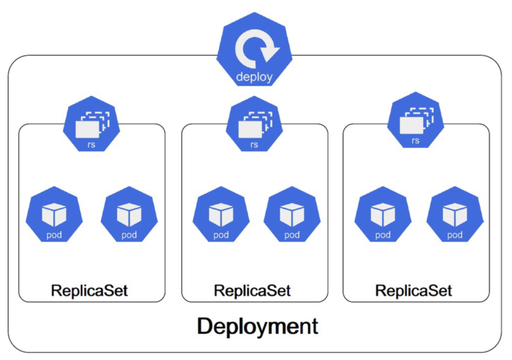

SESSION 3, 4.7.2025 
========================

## Content of the session:

* Choose and use the right workload resource (continue after replicasets)
  * Deployment
  * ReplicaSet
  * DaemonSet
  * Job
  * Cronjob

**Application Deployment**
* Understand Deployments and how to perform rolling updates
* Implement probes and health checks

**Application Environment, Configuration and Security**
* Understand ConfigMaps (pt. 1)

### Daemonsets

Daemonsets ensure that a copy of a specific pod is running on all (or a subset of) nodes in the cluster. They are typically used for background tasks that need to run on every node, such as logging agents or monitoring tools.

> Note: Daemonset cannot be created imperatively. But can be deleted, edited..

What can you do with Daemonsets with help of kubectl?

```bash
k edit ds <daemonset name>
k delete ds <daemonset name>
k get ds <daemonset name>
k get ds -A # get all daemonsets in all namespaces
k get ds <daemonset name> -o yaml # get the manifest of the daemonset
k rollout restart ds <daemonset name> # restart the daemonset
k rollout status ds <daemonset name> # check the status of the daemonset rollout
k describe ds <daemonset name> # describe the daemonset
```
Rollout restart is useful when you want to restart the daemonset pods without changing the manifest. The reason could be for example that you have updated a configmap or secret that is connected to the daemonset, so the pod needs to be restarted in order to mount to the new configmap/secret. It will trigger a rolling update of the daemonset, which will restart all pods managed by the daemonset. 


### TASK! (#1, together)

Let's try to apply the [Daemonset from the docs example](https://kubernetes.io/docs/concepts/workloads/controllers/daemonset/#create-a-daemonset).

```bash
vim ds.yaml
```
Copy the manifest:

```yaml
apiVersion: apps/v1
kind: DaemonSet
metadata:
  name: fluentd-elasticsearch
  namespace: kube-system
  labels:
    k8s-app: fluentd-logging
spec:
  selector:
    matchLabels:
      name: fluentd-elasticsearch
  template:
    metadata:
      labels:
        name: fluentd-elasticsearch
    spec:
      tolerations:
      # these tolerations are to have the daemonset runnable on control plane nodes
      # remove them if your control plane nodes should not run pods
      - key: node-role.kubernetes.io/control-plane
        operator: Exists
        effect: NoSchedule
      - key: node-role.kubernetes.io/master
        operator: Exists
        effect: NoSchedule
      containers:
      - name: fluentd-elasticsearch
        image: quay.io/fluentd_elasticsearch/fluentd:v2.5.2
        resources:
          limits:
            memory: 200Mi
          requests:
            cpu: 100m
            memory: 200Mi
        volumeMounts:
        - name: varlog
          mountPath: /var/log
      # it may be desirable to set a high priority class to ensure that a DaemonSet Pod
      # preempts running Pods
      # priorityClassName: important
      terminationGracePeriodSeconds: 30
      volumes:
      - name: varlog
        hostPath:
          path: /var/log
```
Apply it:

```bash
k apply -f ds.yaml
```

Check the pods in all namespaces:
```
k get po -A -owide | grep fluentd-elasticsearch
```
The pods will be created on all nodes (each pod in different node), and all of them will be within the kube-system namespace.

With daemonsets, as well as with statefulsets or deployments, we can use the `k rollout` command to manage the rollout of the daemonset. For example, we can restart the daemonset to apply changes or to ensure that the pods are running with the latest configuration.

```bash
k rollout restart ds -n kube-system fluentd-elasticsearch 
```
The default rollout strategy for daemonsets is `RollingUpdate`, which means that the pods will be updated one by one, ensuring that there is always at least one pod running on each node. At first, the pod on a node will be terminated, and then a new pod will be created on the same node. 

This is the command you can use to check the status of the rollout (if it is successful, in progress or if there are any issues):

```bash
k rollout status ds fluentd-elasticsearch -n kube-system
```

Unlike with Deployments, which we will see in a while, DaemonSets are built on the principle of one Pod per node. That is why we cannot scale them, as they are not designed to have multiple replicas. 

Delete the DaemonSet:

```bash
k delete ds fluentd-elasticsearch -n kube-system
```
### Jobs

A Job is a Kubernetes controller that is designed for short-lived, one-time tasks. It ensures a pod runs to completion, and if the pod fails, the Job will retry it (based on backoffLimit). Once the task is complete, the Job exits successfully.

```bash
k create job hello --image=busybox --dry-run=client -oyaml -- echo "Hello dear studybuddies"
```

```bash
k get job
k describe job hello
k get job hello -oyaml
k logs job/hello # check the logs of the job - we do not have to specify the unique pod name, because the job has only one pod
```

Let's check a simple job from the official documentation that calculates the value of pi:

```yaml
apiVersion: batch/v1
kind: Job
metadata:
  name: pi
spec:
  template:
    spec:
      containers:
      - name: pi
        image: perl:5.34.0
        command: ["perl",  "-Mbignum=bpi", "-wle", "print bpi(2000)"]
      restartPolicy: Never # Usually set to Never for jobs, because we want the job to run to completion and not restart the pod if it fails - and if we set it to Always, the job will never complete.
  backoffLimit: 4 # The number of retries before the job is considered failed. If the job fails more than this number of times, it will be marked as failed and will not be retried anymore.
```

> Note: Jobs and their pods will be listed also after they are completed unless you either delete them or define .spec.ttlSecondsAfterFinished in the manifest related to the job. In that case the job and its pods will be deleted automatically after the specified time in seconds.

```bash
k explain job.spec # check the spec of the job with explanations
k explain job.metadata --recursive # check the metadata of the job with all the possible fields including tree structure/yaml indentation
```


### CronJobs

Cronjobs are used to run jobs on a scheduled basis, similar to the cron utility in Unix/Linux systems. They allow you to specify a time-based schedule for running jobs, such as daily, weekly, or monthly. Otherwise they are basically the same as Jobs.

You can create a cronjob imperatively using the `k create cronjob --image=<image name> --schedule="<schedule>"` command. For example, to create a cronjob that runs every minute and prints the current date and a message:

```bash
k create cj iscreamfor --image=busybox --schedule="* * * * *" -- echo icecream
``` 
Need to adjust details? Save as yaml file, edit what you need and apply it:
```bash
k create cj iscreamfor --image=busybox --schedule="* * * * *" --dry-run=client -oyaml > cj.yaml -- echo icecream
```

```bash
cat cj.yaml
```

```yaml
apiVersion: batch/v1
kind: CronJob
metadata:
  creationTimestamp: null
  name: iscreamfor
spec:
  jobTemplate:
    metadata:
      creationTimestamp: null
      name: iscreamfor
    spec:
      template:
        metadata:
          creationTimestamp: null
        spec:
          containers:
          - command:
            - echo
            - icecream
            image: busybox
            name: iscreamfor
            resources: {}
          restartPolicy: OnFailure
  schedule: '* */5 * * *'   # Changed to run every 5 hours
status: {}

```
Applying the cronjob:

```bash
k apply -f cj.yaml
```

> Note: do you have a cronjob setup and want to check if it works immediately? You can use the `k create job --from=cronjob/<cronjob name>` command to create a job from the cronjob. This will run the job immediately, and you can check the logs of the job to see if it works as expected.

```bash
k create job --from=cronjob/iscreamfor
job.batch/luxurytest created

k get po 
NAME               READY   STATUS      RESTARTS   AGE
luxurytest-8jfbr   0/1     Completed   0          4s

k logs luxurytest-8jfbr
icecream
```

More options including cron syntax can be found in the [official documentation](https://kubernetes.io/docs/concepts/workloads/controllers/cron-jobs/).

### TASK! (#2)

Create a cronjob:
- name of the cronjob: fortuneteller
- namespace: studybuddies
- name of image: curlimages/curl
- should run every 5 minutes
- command: `curl https://helloacm.com/api/fortune/

Time CAP: 3 minutes.

Stuck on the way? Check the solution in the [./task3_2/solution.md](./task3_2/solution.md) file.

### Deployments + Rolling updates

Deployments are a higher-level abstraction that manages the lifecycle of pods and replicasets. They provide features like rolling updates, rollbacks, and scaling. Deployments ensure that the desired state of the application is maintained, and they automatically handle updates to the application.

Under the hood, a deployment creates a replicaset that manages the pods. When you update a deployment, it creates a new replicaset with the updated pod template and gradually scales down the old replicaset while scaling up the new one. With deployments, you can perform nice rolling updates that allow you to update your application without downtime. You can also rollback to a previous specific version if something goes wrong.


Image source: [kubernetes.io](https://kubernetes.io/docs/concepts/workloads/controllers)

#### Basic commands connected to deployment management:

```bash
k create deploy <deployment name> --image=<image name> --replicas=<number of replicas>
k edit deploy <deployment name>
k scale deploy <deployment name> --replicas=<number of replicas> 
k set image deployment/<name> <container name>=<new image name>
```

Let's try:

```bash
k create deploy importantsession --image=nginx --replicas=3 # create a deployment with 3 replicas of nginx
deployment.apps/importantsession created
```

```bash
k get deploy --watch
importantsession   1/3     3            1           8s
importantsession   2/3     3            2           9s
importantsession   3/3     3            3           10s
```

```bash
k edit deploy importantsession # change the image to busybox, save and exit
k get po --watch
k rollout status deploy/importantsession
k get deploy importantsession -o yaml # check the manifest and image
k scale deploy importantsession --replicas=5 
k set image deploy/importantsession nginx=curlimages/curl # What the hell, why nginx=curlimages/curl? Thats because originally, when we created the deployment imperatively, we chose the image as nginx. Therefore the name for the main container was added as nginx. When you set another image imperatively, you specify the name of the container and the new image. Image will be change, the name of the container will stay the same. In case you do not wish the deployment to have the original name of the container, you need to edit it in the deployment manifest.
```

The amazing feature of deployments is their ability to rollback through history.

```bash
k rollout status deploy/<deployment name> # check the status of the deployment rollout
k rollout undo deploy/<deployment name> # rollback to the previous version of the deployment
k rollout history deploy/<deployment name> # check the history versions of the deployment
k rollout undo deploy <deployment name> --to-revision=<revision number> # rollback to a specific version of the deployment
```
> Tip: Don't remember during exam what the hell was the rollout command? You can always use `k rollout -h` to get the explanation of the command with possible options and clear examples.

Let's see it on the example of our `importantsession` deployment:

```bash
k rollout history deploy/importantsession
deployment.apps/importantsession
REVISION  CHANGE-CAUSE
1         <none>
2         <none>
3         <none>
```

If you want to add the change of the changed-cause to the history, the change needs to be done together with the annotation:
```yaml
metadata:
  annotations:
    kubernetes.io/change-cause: "Updated image to v2.0"
```
alternatively, you can use the `--record` flag when creating or updating the deployment:
```bash
k set image deploy/importantsession nginx=curlimages/curl --record  

k rollout history deploy/importantsession
REVISION  CHANGE-CAUSE
1         <none>
3         <none>
4         kubectl set image deploy/importantsession nginx=curlimages/curl --record=true
```

### TASK! (#3)

* Create a deployment with the following specifications:
  - name: mylittledeploy
  - image: nginx
  - replicas: 3

* When done, scale the deployment to 5 replicas using the imperative approach
* Change the image of the deployment to `busybox` just with command
* Undo the last change

Time CAP: 3 minutes <br>
Stuck on the way? Check the solution in the [./task3_3/solution.md](./task3_3/solution.md) file.

### Implement probes and health checks

#### What Are Probes?
Kubernetes uses probes to check the health of containers. These are automated checks that determine whether to:

- Restart the container (Liveness Probe)
- Send traffic to the container (Readiness Probe)
- Wait before running other probes (Startup Probe)

#### Liveness probe
Checks if the app is alive. If it fails, Kubernetes restarts the container.

```yaml
livenessProbe:
  httpGet:
    path: /healthz
    port: 8080
  initialDelaySeconds: 5
  periodSeconds: 10
```

#### Readiness probe

Checks if the app is ready to receive traffic.
If it fails, the pod is removed from service endpoints but not restarted.

```yaml
readinessProbe:
  tcpSocket:
    port: 8080
  initialDelaySeconds: 5
  periodSeconds: 10
```
Readiness and liveness probes can be used in parallel for the same container. Using both can ensure that traffic does not reach a container that is not ready for it, and that containers are restarted when they fail.

####  Startup Probe 
Used when your app takes a while to start.
Only runs during startup, and disables liveness/readiness during that time.

```yaml
startupProbe:
  exec:
    command: ["cat", "/tmp/healthy"]
  failureThreshold: 30
  periodSeconds: 5
```
Startup Probe tells Kubernetes when your container has finished starting up. <br>
Until this probe succeeds:

- Liveness and readiness probes are disabled
- Kubernetes will wait patiently, even if the app is not yet responding

This prevents Kubernetes from killing your container too early just because it takes a while to become ready.


### HOMEWORK! (#1)

Create a deployment with the following specifications:

- *Name*: probeofmylife
- *Namespace*: studybuddies
- *Replicas*: 2
- *Image*: nginxdemos/hello:0.2

*Probes*:
*StartupProbe*
- Use a HTTP GET to /
- *Port*: 80
- *Delay*: Allow up to 30 seconds for the app to start
- *FailureThreshold*: 15 # 
- *PeriodSeconds*: 2

*ReadinessProbe*
- Use HTTP GET to /
- *Port*: 80
- *InitialDelaySeconds*: 5
- *PeriodSeconds*: 5

*LivenessProbe*
- Use HTTP GET to /
- *Port*: 80
- *InitialDelaySeconds*: 10
- *PeriodSeconds*: 10

Use VIM for editing the manifest file. Pay attention to indentation and syntax.

Hint: Create the base with `--dry-run=client -oyaml` option to generate the YAML manifest of the deployment, edit it in VIM and apply it using `kubectl apply -f <file.yaml>`.
Hint 2: Docs are your friend. Copy parts of the code you need for probes!

Stuck on the way? Check the solution in the [./homework2_1/solution.md](./task2_1/solution.md) file.

### Configmaps

ConfigMaps are used to store non-sensitive configuration data in key-value pairs. They allow you to decouple configuration from application code, making it easier to manage and update configurations without changing the application image.

#### Create a ConfigMap
You can create a ConfigMap using a YAML file or imperatively with the `k create cm` command.

```bash
k create cm <configmap name> --from-literal=key1=value1 --from-literal=key2=value2
``` 
Using `--from-literal` allows you to define key-value pairs directly in the command line.

```bash
k create cm <configmap name> --from-env-file=path/to/foo.env --from-env-file=path/to/bar.env
```
If you use env-file, the keys within the file will be the names of the variables in the file and the values will be the values of the variables.


```bash
k create cm <configmap name> --from-file=key1=/path/to/bar/file1.txt --from-file=key2=/path/to/bar/file2.txt
``` 
In the example above, keys are directly defined and values are read from files. If the file key name is not specified, the file name will be used as the key in the ConfigMap. Or in ohter words, if you want to specify a different key name, you can use the `--from-file=<key>=<path>` option.


### TASK! (#7)

Create two configmaps:
1. `holyconfig` with two key-value pairs: `BESTCHAPTERINTHEWORLD=security` 
2. `holyconfig2` from a file `config` within the [task3_4/](./task3_4/) folder. 

Once done, write to the chat a happy emoji of your choice.

Time CAP: 3 minutes. <br>
Stuck on the way? Check the solution in the [./task3_4/solution.md](./task3_4/solution.md) file.

## Wrap up
Congratulations on completing the third session of the Study Buddies series!

Today, we have learned:

* Some more workload resource types in Kubernetes, such as Deployments, DaemonSets, Jobs, and CronJobs
* How to perform rolling updates and manage application deployments
* How to use probes and health checks to ensure the reliability of your applications
* How to create ConfigMaps by defining key-value pairs and using files

I  hope this session gave you some knowledge and inspiration despite its Friday afternoon schedule. Please let me know your feedback and any improvement suggestions, this should help us all with preparation and the right feedback would make this serie more efficient.

