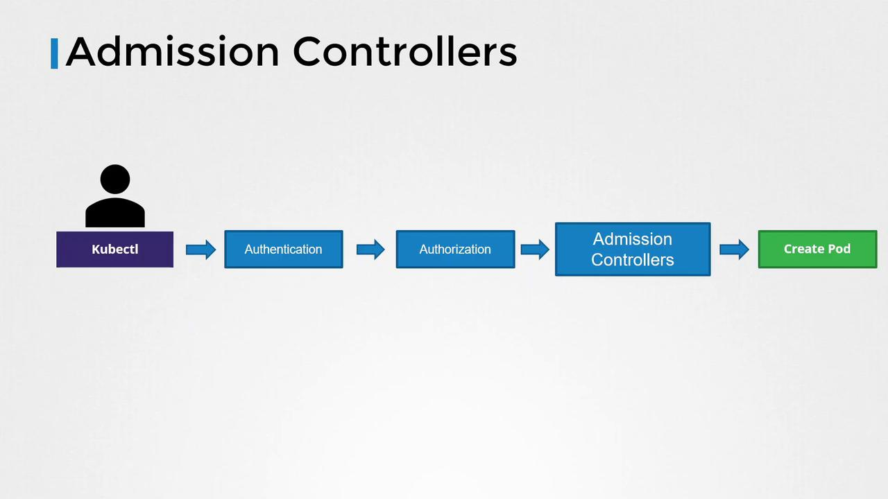
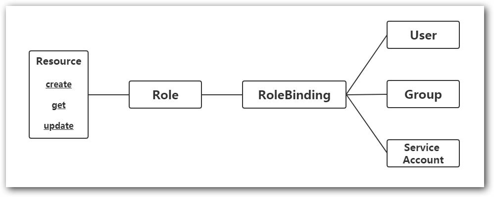

SESSION 7, 14.7.2025 
========================

* Understand authentication, authorization and admission control
* Role-Based Access Control (RBAC) on namespace level
* Services:
  * ClusterIP
  * NodePort
  * LoadBalancer
  * ExternalName
  * Headless

## Understand authentication, authorization and admission control

 <br>
Image source: [Kodekloud](https://notes.kodekloud.com/docs/Certified-Kubernetes-Application-Developer-CKAD/Security/Admission-Controllers)

### 1. Authentication (Who are you?)

Authentication is about **verifying the identity of a user or service** (e.g., via kubeconfig or service account tokens). You don’t configure it, but it determines who can interact with the cluster. Kubernetes checks who is making the request.

This could be a user, service account, or external identity (via certificates, tokens, etc.).

When you run `kubectl`, it uses your kubeconfig file to authenticate you:

```bash
k config view
```
This shows your current context, user, and cluster information. In CKAD, you typically use service accounts for your applications, which are automatically created in namespaces.

Most commonly in CKAD, this shows up when:
* Your pod is running with a service account
* You get Unauthorized errors if the kubeconfig is wrong or permissions are missing

In the CKAD exam, each question may point to a specific Kubernetes environment (like a node or namespace) that you need to SSH into or set as your context.

```bash
ssh <node name>
```
```bash
k config use-context <context>
```

These environments will be preconfigured with specific contexts, namespaces, or workloads required for that task.

If you skip the SSH/context step, you could end up:
- Working in the wrong environment
- Changing the wrong cluster or namespace
- Losing points or failing that task

```bash
k config get-contexts
k config use-context <context>
k config current-context  
```
To get the config with certs etc:
```bash
k config view --raw
```

To get the config with certs only for the current context:
```bash
k config view --raw --minify
```

When running commands through the pods, you are authenticated as the service account associated with that pod. 

###  2. Authorization (What can you do?)

Authorization controls what an authenticated user or service can do in the cluster, using RBAC (Role, RoleBinding, etc.). <br>

After identifying who, Kubernetes checks what they’re allowed to do. In the context of CKAD, this is often about giving your application the right permissions to access Kubernetes resources in the forme of RBAC - Role-Based Access Control. <br>

In CKAD, you're expected to create and use these roles to grant specific permissions to service accounts or users. For this exam, it is required on the namespace level.

#### Role-Based Access Control (RBAC)

RBAC is the most common way to control access in Kubernetes. It uses **Roles** and **RoleBindings** to define what actions users or service accounts can perform on resources. There is also cluster-wide RBAC using ClusterRoles and ClusterRoleBindings, but that's not typically needed for CKAD.

**Roles**: define permissions for resources in a namespace, while ClusterRoles define permissions across the entire cluster. <br>
**Rolebindings**: bind a Role to a user or service account, granting them the permissions defined in the Role.

 <br>

Image source: [iNews](https://inf.news/en/news/08074667a2d9b64ce7932e26f4cfb43f.html)

Do you remember the default ServiceAccount created in each namespace? By default, it has no permissions. You need to create a Role and RoleBinding to give it access to resources. 

#### Example Role and RoleBinding

```yaml
apiVersion: rbac.authorization.k8s.io/v1
kind: Role
metadata:
  namespace: ninjanamespace
  name: pod-ninja
rules:
- apiGroups: [""] # "" indicates the core API group
  resources: ["pods"]
  verbs: ["get", "watch", "list"]
```

It is possible to do it imperatively as well:

```bash
kubectl create role pod-ninja --verb=get,list,watch --resource=pods --namespace ninjanamespace
``` 

If you want to use all verbs:

```bash
kubectl create role pod-ninja --verb='*' --resource=pods --namespace ninjanamespace
``` 

When we create a Role, we define *what* is allowed. But if we really want to use it, we need to *connect this role to either a user, group or a service account*. This is done with RoleBinding.

```yaml
apiVersion: rbac.authorization.k8s.io/v1
kind: RoleBinding
metadata:
  name: pod-admin-binding
  namespace: studybuddies
subjects:                                             # You can specify more than one "subject"               
- kind: User
  name: jaja                                          # "name" is case sensitive
  apiGroup: rbac.authorization.k8s.io
roleRef:                                              # specifies the binding to a Role 
  kind: Role                                          #this must be Role 
  name: pod-ninja                                     # this must match the name of the Role you wish to bind to
  apiGroup: rbac.authorization.k8s.io
  ```
Good news! We can create RoleBindings imperatively as well:

```bash
k create rolebinding pod-admin-binding --role=pod-ninja --user=jaja --namespace studybuddies
```
In general:

```bash
k create rolebinding <binding name> --role=<role name> --user=<user 1> --user=<user 2> --group=<group 1>
k create rolebinding <binding name> --role=<role name> --serviceaccount=<namespace>:<serviceaccount> --namespace studybuddies
```
How to find out what permissions a user or service account has?

```bash
k auth can-i <verb> <resource type> --as system:serviceaccount:<namespace>:<serviceaccount>
```

### 3. Admission Control

Admission controllers enforce policies on objects after authentication and authorization, but before they’re persisted. In CKAD, you're not asked to configure them, but should understand how they might reject or mutate your resources (e.g., missing resource limits or disallowed security contexts).

### TASK! (#1)

Create a Role named `loyal-role` in the `studybuddies` namespace that allows to read and list pods. 
Then create a RoleBinding that binds this role to the ServiceAccount `loyalservant` we created some time ago within the same namespace.

Once done, send some happiness to the channel chat!


## Services

Services in Kubernetes provide stable networking for Pods, allowing them to communicate with each other and with external clients. They abstract away the underlying Pod IPs, which can change over time.

What are the main functions of a Service:
* provides a stable network identity (IP + DNS name) to a set of Pods.
* routes traffic to matching Pods using label selectors.
* decouples clients from Pods — which may come and go.
* provide load balancing across Pods (not only the LoadBalancer type :) )

**Types of Services**
**ClusterIP**:	Exposes service within the cluster	Default, used for internal communication
**NodePort**	Exposes service on a port on each Node’s IP	Useful for local testing, not recommended for production
**LoadBalancer**	Uses cloud provider's external LB	For public access in cloud setups
**ExternalName**	Maps to an external DNS	Rarely used in CKAD; just know what it is
**HeadLess**	No ClusterIP, direct Pod access	Useful for StatefulSets or peer-to-peer apps


### How to create a Service
You can create a Service:
- using a YAML manifest
- imperatively with `k expose`
- imperatively with `k create service`.

### ClusterIP (default)

The default type, ClusterIP, exposes the service on a cluster-internal IP. This means that the service is only reachable from within the cluster. It is used for internal communication between Pods.   

```yaml
apiVersion: v1
kind: Service
metadata:
  name: my-beautiful-service
spec:
  selector:
    app: my-beautiful-app
  ports:
    - port: 80                               # Service port
      targetPort: 8080                       # Container port
```

```bash
k expose <resource> <name> --port=<external port> [--target-port=<container-port>] [--type=<service-type>] [--name=<service-name>] [--protocol=TCP|UDP]

k expose deployment my-beautiful-app --port=80 --target-port=8080
```

>Note: this will not work if you do not have a Deployment named `my-beautiful-app` in the current namespace.

**What It Does**
- Creates a Service of the specified type (default: ClusterIP)
- Points it to the target port on the selected resource (e.g., a pod or deployment). In case you will not specify the target port, it will use the first container port of the Pod.

### TASK! (#2)

There is a deployment manifest definition called [my-beautiful-app.yaml](task7_2/my-beautiful-app.yaml) in the [task7_2](task7_2) folder. 

- in the Playground, create a new namespace called `studybuddies`
- apply it to create the Deployment in the `studybuddies` namespace
- expose it as a ClusterIP Service named `my-beautiful-service` that targets Pods with label `app=my-beautiful-app` and forwards traffic from port 80 to container port 8080

Once done, express your happiness in the channel chat!

 <br>


### NodePort
NodePort exposes the service on a static port on each Node's IP. This allows external traffic to access the service by hitting any Node's IP and the specified port. It's useful for local testing, but not recommended for production.

```yaml
spec:
  type: NodePort
  selector:
    app: myapp
  ports:
    - port: 80
      targetPort: 8080
      nodePort: 30036
```

```bash
k expose <resource> <name> --port=<external port> [--target-port=<container-port>] [--type=<service-type>] [--name=<service-name>] [--protocol=TCP|UDP]

k expose deployment my-beautiful-app --port=80 --target-port=8080 --type=NodePort --name=my-beautiful-nodeport-service --namespace=studybuddies
```

### TASK! (#3)

Please, do this task in the [Killercoda Playground](https://killercoda.com/playgrounds/scenario/kubernetes) instead of your local Kubernetes cluster.

There is a deployment manifest definition called [my-beautiful-nodeport-app.yaml](task7_2/my-beautiful-nodeport-app.yaml) in the [task7_3](task7_3) folder. 

- apply it to create the Deployment in the `studybuddies` namespace.
- expose it as a ClusterIP Service named `my-beautiful-nodeport-service` that targets Pods with label `app=my-beautiful-app` and forwards traffic from port 80 to container port 8080

Once done, express your happiness in the channel chat!


### LoadBalancer
LoadBalancer is used in cloud environments to expose the service externally. It creates an external load balancer that routes traffic to the service. This is the most common way to expose services in production.

```yaml
apiVersion: v1
kind: Service
metadata:
  name: myapp-service
  namespace: studybuddies
spec:
  type: LoadBalancer
  selector:
    app: myapp
  ports:
    - port: 80                                     # Exposed service port
      targetPort: 8080                             # Container port
```

*What this does:*
- Exposes your app to external traffic via a cloud provider's LoadBalancer.
- The service is reachable via an external IP (automatically assigned, will not work with local environment).
- Internally, traffic is routed to Pods with label app: myapp, hitting port 8080 on the container.

*Use this when:
- You're in a cloud environment (Openstac, AWS, GCP, Azure...)
- You need external access to your app.
- You want automatic IP + DNS assignment via the provider.


### BONUS: ExternalName Service

A Service of type ExternalName creates a DNS alias inside the cluster.

```yaml
apiVersion: v1
kind: Service
metadata:
  name: cute-external-service
  namespace: studybuddies
spec:
  type: ExternalName
  externalName: httpbin.org
```

In the example above, when looking up the host cute-external-service.prod.svc.cluster.local, the cluster DNS Service returns a CNAME record with the value httpbin.org.

Let's try it together!

In the folder [externalname](session_7/externalname), you will find two files: [pod.yaml](session_7/externalname/pod.yaml) and [service.yaml](session_7/externalname/service.yaml). Apply them in the `studybuddies` namespace.

```bash
k apply -f session_7/externalname/pod.yaml
k apply -f session_7/externalname/service.yaml
```
Now, let's test it by running a curl command in the pod:

```bash
k exec -it curl-test -n studybuddies -- curl cute-external-service/get
```

>Note: httpbin.org is a free, open-source HTTP request & response testing service. It's designed for developers to inspect HTTP requests, simulate different kinds of responses and test HTTP clients (e.g., curl, Postman, code). /get is one of its endpoints that returns a JSON response with details about the request made to it.


### Headless Service

A Headless Service is a Service with no ClusterIP. It doesn’t load balance - instead, it lets you reach individual Pod IPs directly.

```yaml
apiVersion: v1
kind: Service
metadata:
  name: my-headless-service
  namespace: studybuddies
spec:
  clusterIP: None
  selector:
    app: myapp
  ports:
    - port: 80
```
Headless services are most commonly used with StatefulSets, where each pod needs a stable DNS name.


```yaml
apiVersion: v1
kind: Service
metadata:
  name: nginx
  namespace: studybuddies
spec:
  clusterIP: None                       # None = Headless
  selector:
    app: nginx
  ports:
    - port: 80
```

```yaml
apiVersion: apps/v1
kind: StatefulSet
metadata:
  name: nginx
  namespace: studybuddies
spec:
  serviceName: nginx                    # Must match the headless service name
  replicas: 3
  selector:
    matchLabels:
      app: nginx
  template:
    metadata:
      labels:
        app: nginx
    spec:
      containers:
        - name: nginx
          image: nginx
          ports:
            - containerPort: 80
```

Let's try it together! In the folder [headless](session_7/headless), you will find two files: [service.yaml](session_7/headless/service.yaml) and [statefulset.yaml](session_7/headless/statefulset.yaml). Apply them in the `studybuddies` namespace.

And now, let's test it by running a curl command in the pod:


```bash
k run -it --rm tester --image=curlimages/curl -n studybuddies --restart=Never -- sh

curl echo-0.echo-headless.studybuddies.svc.cluster.local:8080
```


>Notes: In the context of CKAD, you should be able to create a Service YAML from scratch or imperatively, connect pods to services using labels/selectors and understand how DNS resolution works (`my-service.my-namespace.svc.cluster.local`)

## Wrap up
7th session is over!

Today, we have learned:
* Understand authentication, authorization and admission control
* Role-Based Access Control (RBAC) on namespace level
* How to work with Services: ClusterIP, NodePort, LoadBalancer end even ExternalName and Headless as bonus

Great job, buddies! You are getting closer to the CKAD exam ;)


