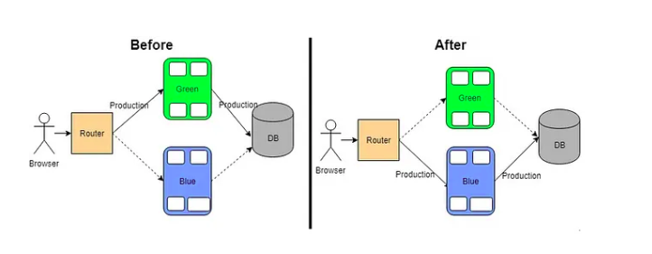

SESSION 8, 16.7.2025 
========================

* How to work with Services: LoadBalancer, ExternalName, Headless
* Blue/Green, Canary deployments in Kubernetes native way
* Ingress, Use Ingress rules to expose applications
* Provide and troubleshoot access to applications via services

### LoadBalancer
LoadBalancer is used in cloud environments to expose the service externally. It creates an external load balancer that routes traffic to the service. This is the most common way to expose services in production.

```yaml
apiVersion: v1
kind: Service
metadata:
  name: cool-app-service
  namespace: studybuddies
spec:
  type: LoadBalancer
  selector:
    app: myapp
  ports:
    - port: 80                                     # Exposed service port
      targetPort: 8080                             # Container port
```

Creating a service with the svc create command:

```bash
k create svc <type of service> <name of service> --tcp=<port>:<target port> 

k create svc loadbalancer cool-app-service --tcp=80:8080 --tcp=443:443 --dry-run=client -oyaml
```
```yaml
apiVersion: v1
kind: Service
metadata:
  creationTimestamp: null
  labels:
    app: cool-app-service
  name: cool-app-service
spec:
  ports:
  - name: 80-8080
    port: 80
    protocol: TCP
    targetPort: 8080
  - name: 443-443
    port: 443
    protocol: TCP
    targetPort: 443
  selector:
    app: cool-app-service                        # Label to match Pods
  type: LoadBalancer
status:
  loadBalancer: {}
```

*What this does:*
- Exposes your app to external traffic via a cloud provider's LoadBalancer.
- The service is reachable via an external IP (automatically assigned, will not work with local environment).
- Internally, traffic is routed to Pods with label

*Use this when:
- You're in a cloud environment (Openstac, AWS, GCP, Azure...)
- You need external access to your app.
- You want automatic IP + DNS assignment via the provider.

### TASK! (#1)

- Create a pod in the `studybuddies` namespace with name `lunchserver` and image `littlesvensson/lunchserver:v2 `
- Create a LoadBalancer service for the  `lunchserver` pod, use service port 80 and target port 8080
- Unfortunately, we will not get assigned IP in the local environment, but you can check the service with `k get svc -n studybuddies` and see that it has type LoadBalancer.
- If you want to test it, you can use the `curl` command in the pod to check if the service is working, e.g. `k run -it --rm tester --image=curlimages/curl -n studybuddies --restart=Never -- sh` and then:
  - either `curl <service ip>:<service port>` 
  - or `curl lunchserver:80` (if you have DNS resolution working in your cluster)
  - if you were in a different namespace with the testing pod, you would need to write the full dns name for the service: `curl lunchserver.studybuddies.svc.cluster.local:80` 

Done? Express your happiness in the chat! 

### BONUS: ExternalName Service

A Service of type ExternalName creates a DNS alias inside the cluster.

```yaml
apiVersion: v1
kind: Service
metadata:
  name: cute-external-service
  namespace: studybuddies
spec:
  type: ExternalName
  externalName: httpbin.org
```

In the example above, when looking up the host cute-external-service.prod.svc.cluster.local, the cluster DNS Service returns a CNAME record with the value httpbin.org.

Let's try it together!

In the folder [externalname](session_7/externalname), you will find two files: [pod.yaml](session_7/externalname/pod.yaml) and [service.yaml](session_7/externalname/service.yaml). Apply them in the `studybuddies` namespace.

```bash
k apply -f session_8/externalname/pod.yaml
k apply -f session_8/externalname/service.yaml
```
Now, let's test it by running a curl command in the pod:

```bash
k exec -it curl-test -n studybuddies -- curl cute-external-service/get
```

>Note: httpbin.org is a free, open-source HTTP request & response testing service. It's designed for developers to inspect HTTP requests, simulate different kinds of responses and test HTTP clients (e.g., curl, Postman, code). /get is one of its endpoints that returns a JSON response with details about the request made to it.

>Note: A good use case for an ExternalName service is to allow Kubernetes workloads to access an external database (like db.example.com) using a consistent internal DNS name (db.my-namespace.svc.cluster.local) without exposing it via an internal proxy - It's good because it lets you abstract external dependencies behind Kubernetes-native DNS names, so your apps can use the same service discovery mechanism (<service>.<namespace>.svc) for both internal and external services — making configuration simpler, portable, and easier to manage.

### Headless Service

A Headless Service is a Service with no ClusterIP. It doesn’t load balance - instead, it lets you reach individual Pod IPs directly.

```yaml
apiVersion: v1
kind: Service
metadata:
  name: my-headless-service
  namespace: studybuddies
spec:
  clusterIP: None
  selector:
    app: myapp
  ports:
    - port: 80
```
Headless services are most commonly used with StatefulSets, where each pod needs a stable DNS name.

```yaml
apiVersion: v1
kind: Service
metadata:
  name: nginx
  namespace: studybuddies
spec:
  clusterIP: None                       # None = Headless
  selector:
    app: nginx
  ports:
    - port: 80
```

```yaml
apiVersion: apps/v1
kind: StatefulSet
metadata:
  name: nginx
  namespace: studybuddies
spec:
  serviceName: nginx                    # Must match the headless service name
  replicas: 3
  selector:
    matchLabels:
      app: nginx
  template:
    metadata:
      labels:
        app: nginx
    spec:
      containers:
        - name: nginx
          image: nginx
          ports:
            - containerPort: 80
```

Let's try it together! In the folder [headless](session_7/headless), you will find two files: [service.yaml](session_7/headless/service.yaml) and [statefulset.yaml](session_7/headless/statefulset.yaml). Apply them in the `studybuddies` namespace.

And now, let's test it by running a curl command in the pod:


```bash
k run -it --rm tester --image=curlimages/curl -n studybuddies --restart=Never -- sh

curl echo-0.echo-headless.studybuddies.svc.cluster.local:8080
```

>Note: What’s the Point of port: 80 in the Service YAML? It’s useful for SRV records (used by some clients), uniformity in service definitions, service discovery when using regular (non-headless) services, APIs or tools that might inspect the service port definition. But in our headless case — especially with a StatefulSet — it doesn't affect curl directly.
>Note2: In the context of CKAD, you should be able to create a Service YAML from scratch or imperatively, connect pods to services using labels/selectors and understand how DNS resolution works (`my-service.my-namespace.svc.cluster.local`)

## Blue/Green Deployment (CKAD Level)

A Blue-Green Deployment is a deployment strategy where two identical environments, the “blue” environment and the “green” environment, are set up. The blue environment is the production environment, where the live version of the application is currently running, and the green environment is the non-production environment, where new versions of the application are deployed.

When a new version of the application is ready to be deployed, it is deployed to the green environment. Once the new version is deployed and tested, traffic is switched to the green environment, making it the new production environment. The blue environment then becomes the non-production environment, where future versions of the application can be deployed.

 <br>
Image source: [medium.com](https://medium.com/cloud-native-daily/blue-green-deployments-with-kubernetes-a-comprehensive-guide-5d196dad1976)

### Task! (#2)

In the folder task8_2, you will find manifess for both blue and green deployment in the deployments.yaml file. Apply them in the `studybuddies` namespace.

- Create a Service with name `green-blue` that selects the blue version of the app (version: blue). Service port should be 80 and target port should be 8080. 
- Check if the Service is working by running a curl command in the pod:

```bash
k run -it --rm tester --image=curlimages/curl -n studybuddies --restart=Never -- sh
curl green-blue
```
- Edit the Service to select the green version of the app (version: green). You can do it by doint the changes through k `edit svc -n studybuddies green-blue` or by changing the `deployment.yaml` file and applying it again.
- Check if the Service is still working by running a curl command in the pod:

```bash
k run -it --rm tester --image=curlimages/curl -n studybuddies --restart=Never -- sh
curl green-blue
```

## Canary Deployment

A canary deployment in Kubernetes is a strategy where a small subset of users is routed to a new version of an application, while the rest continue using the stable version. This allows teams to test and monitor the new release in production with minimal risk before gradually rolling it out to all users.

### How It Works

```yaml
# Stable Deployment (v1)
metadata:
  name: myapp-v1
  labels:
    app: myapp
    version: v1

# Canary Deployment (v2)
metadata:
  name: myapp-v2
  labels:
    app: myapp
    version: canary

# Shared Service selects both
spec:
  selector:
    app: myapp
```

### TASK! (#3)

- Apply manifest for two deployments in the `task8_3` folder. The first one is the stable version (v1) and the second one is the canary version (canary).
- Create a ClusterIP Sevice with name `canary-service` that selects both deployments (v1 and canary) and exposes them on port 80. The target port should be 8080.
- Check if the Service is working by running a curl command in the pod:

```bash
k run -it --rm tester --image=curlimages/curl -n studybuddies --restart=Never -- sh
while true; do curl canary-service; sleep 1; done
```
- scale the canary deployment to 3 replicas and test the curl command again. You should see that the responses are coming from both deployments.
- scale the stable deployment to 0 replicas and test the curl command again. You should see that the responses are coming only from the canary deployment.


## Ingress

An Ingress resource in Kubernetes manages external access to services within a cluster, typically via HTTP or HTTPS. It defines rules for routing traffic based on the request's host or path to the appropriate backend services.

The rules specified within by the ingress object are interpreted by an **Ingress Controller** which is a Kubernetes component that watches Ingress resources and manages the actual routing of external HTTP/HTTPS traffic to the appropriate services inside the cluster. The Ingress Controller does not come by default; you need to deploy one, such as the NGINX Ingress Controller or Traefik. <br>

In the context of CKAD, you should be able to create an Ingress resource, understand its basic structure, and know that an Ingress Controller is required for it to function. However, you are not expected to install or configure an Ingress Controller in the exam environment.

Let's have a look at the basic structure of an Ingress resource from the documentation:

```yaml
apiVersion: networking.k8s.io/v1
kind: Ingress
metadata:
  name: minimal-ingress
  annotations:
    nginx.ingress.kubernetes.io/rewrite-target: /
spec:
  ingressClassName: nginx-example                   # Define the Ingress Controller to use
  rules:
  - http:
      paths:
      - path: /testpath
        pathType: Prefix                            # Request path based on a prefix match
        backend:
          service:
            name: test
            port:
              number: 80
```
**nginx.ingress.kubernetes.io/rewrite-target: /** : rewrite the matched request path to / before forwarding it to the backend service. If your Ingress rule matches /testpath as in the example, and a client requests /testpath/home, the path sent to the backend will be rewritten to /home <br>
**ingressClassName**: Specify the Ingress Controller you want to use. You can get the name of the Ingress Controller by running `k get ingressclass`. <br>
**pathType**: Defines how the path is matched. Common values are `Prefix` (matches all paths starting with the specified path) and `Exact` (matches only the exact path) <br>
**service.name**: The name of the service to route traffic to <br>
**service.port.number**: The port on the service to route traffic to <br>
**backend**: Defines the backend service to route traffic to based on the specified rules. It's a combination of the service name and port. <br>

> Note: It is possible to define a default backend service that will handle requests that do not match any of the specified rules. This is done by adding a `defaultBackend` section in the `spec` of the Ingress resource. However, this is [usually setup on the level of the Ingress Controller](https://kubernetes.github.io/ingress-nginx/examples/customization/custom-errors/), not in the Ingress resource itself.

Common Ingress Tasks in CKAD:

- Create an Ingress to expose a service
- Route multiple paths or hostnames
- Fix an Ingress that's misconfigured (e.g., wrong pathType, wrong service name)

> Note:TLS Support - You’re not required to deeply configure TLS, but should recognize a TLS block:

```yaml
tls:
- hosts:
  - myapp.example.com
  secretName: tls-secret
```

### Task! (#4)

This time, the task is awaiting you in the [Killercoda: Ingress create section].(https://killercoda.com/killer-shell-ckad/scenario/ingress-create). Once you will get the last check successfully, please do not close the scenario, just express your happiness in the chat, we will do some check together.

The check:

```bash
curl -H "Host: world.universe.mine" http://localhost:<ingress controller node port>/europe  
curl -H "Host: world.universe.mine" http://localhost:<ingress controller node port>/asia
```
You're sending the request to the node port, which is the NodePort exposed by the NGINX Ingress Controller. This internally forwards the request to port 80 of the Ingress controller pod. In Killercoda, localhost works because you're testing from the controlplane node, which runs the ingress controller. The part -H "Host: world.universe.mine" is crucial because it tells the Ingress controller which host to match against the rules defined in the Ingress resource. The Ingress rule matches by Host. We are imitating a real-world scenario where you would access the service via a domain name (world.universe.mine) instead of an IP address.


## Wrap up
8th session is behind us, ou yeaaaaah!

Today, we have had a look at:
* Some new Service types: LoadBalancer, ExternalName, Headless
* How to do Blue/Green and Canary deployments in Kubernetes native way
* What is Ingress and how to use it

Good work, studybuddies! The last session is ahead of us, so let's keep the pace!


