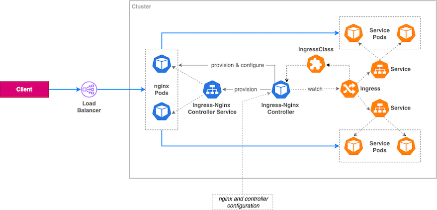

SESSION 9, 18.7.2025 
========================

* Ingress
* Network Policies

## Ingress

An Ingress resource in Kubernetes manages external access to services within a cluster, typically via HTTP or HTTPS. It defines rules for routing traffic based on the request's host or path to the appropriate backend services.

The rules specified within by the ingress object are interpreted by an **Ingress Controller** which is a Kubernetes component that watches Ingress resources and manages the actual routing of external HTTP/HTTPS traffic to the appropriate services inside the cluster. The Ingress Controller does not come by default; you need to deploy one, such as the NGINX Ingress Controller or Traefik. <br>

In the context of CKAD, you should be able to create an Ingress resource, understand its basic structure, and know that an Ingress Controller is required for it to function. However, you are not expected to install or configure an Ingress Controller in the exam environment.

 <br>
Image source: [AWS](https://aws.amazon.com/blogs/containers/exposing-kubernetes-applications-part-3-nginx-ingress-controller/)

The controller deploys, configures, and manages Pods that contain instances of nginx, which is a popular open-source HTTP and reverse proxy server. These Pods are exposed via the controller’s Service resource, which receives all the traffic intended for the relevant applications represented by the Ingress and backend Services resources. The controller translates Ingress and Services’ configurations, in combination with additional parameters provided to it statically, into a standard nginx configuration. It then injects the configuration into the nginx Pods, which route the traffic to the application’s Pods.

Let's have a look at the basic structure of an Ingress resource from the documentation:

```yaml
apiVersion: networking.k8s.io/v1
kind: Ingress
metadata:
  name: minimal-ingress
  annotations:
    nginx.ingress.kubernetes.io/rewrite-target: /
spec:
  ingressClassName: nginx-example                   # Define the Ingress Controller to use
  rules:
  - http:
      paths:
      - path: /testpath
        pathType: Prefix                            # Request path based on a prefix match
        backend:
          service:
            name: test
            port:
              number: 80
```
**nginx.ingress.kubernetes.io/rewrite-target: /** : rewrite the matched request path to / before forwarding it to the backend service. If your Ingress rule matches /testpath as in the example, and a client requests /testpath/home, the path sent to the backend will be rewritten to /home <br>
**ingressClassName**: Specify the Ingress Controller you want to use. You can get the name of the Ingress Controller by running `k get ingressclass`. <br>
**pathType**: Defines how the path is matched. Common values are `Prefix` (matches all paths starting with the specified path) and `Exact` (matches only the exact path) <br>
**service.name**: The name of the service to route traffic to <br>
**service.port.number**: The port on the service to route traffic to <br>
**backend**: Defines the backend service to route traffic to based on the specified rules. It's a combination of the service name and port. <br>

> Note: It is possible to define a default backend service that will handle requests that do not match any of the specified rules. This is done by adding a `defaultBackend` section in the `spec` of the Ingress resource. However, this is [usually setup on the level of the Ingress Controller](https://kubernetes.github.io/ingress-nginx/examples/customization/custom-errors/), not in the Ingress resource itself.

Common Ingress Tasks in CKAD:

- Create an Ingress to expose a service
- Route multiple paths or hostnames
- Fix an Ingress that's misconfigured (e.g., wrong pathType, wrong service name)

> Note:TLS Support - You’re not required to deeply configure TLS, but should recognize a TLS block:

```yaml
tls:
- hosts:
  - myapp.example.com
  secretName: tls-secret
```

### Task! (#1)

This time, the task is awaiting you in the [Killercoda: Ingress create section].(https://killercoda.com/killer-shell-ckad/scenario/ingress-create). Once you will get the last check successfully, please do not close the scenario, just express your happiness in the chat, we will do some check together.

The check:

```bash
curl -H "Host: world.universe.mine" http://localhost:<ingress controller node port>/europe  
curl -H "Host: world.universe.mine" http://localhost:<ingress controller node port>/asia
```
You're sending the request to the node port, which is the NodePort exposed by the NGINX Ingress Controller. This internally forwards the request to port 80 of the Ingress controller pod. In Killercoda, localhost works because you're testing from the controlplane node, which runs the ingress controller. The part -H "Host: world.universe.mine" is crucial because it tells the Ingress controller which host to match against the rules defined in the Ingress resource. The Ingress rule matches by Host. We are imitating a real-world scenario where you would access the service via a domain name (world.universe.mine) instead of an IP address.

### TASK! (#2) 
In the folder [task9_2](./task9_2/), you have [manifest definitions](./task9_2/manifests.yaml) for some of the resources we have discussed. Apply them to the cluster and check if everything is working as expected. If not, try to fix the issues.

For testing, you can use the same playground as for the task 1 and check if the request flow works correctly by running a command:

```bash
curl -H "Host: homework.yourcooldomain.com" http://localhost:<NodePort Port>/
```

## Network Policies

#### Key Concepts

NetworkPolicies control which pods can communicate with each other (and with the outside world) at the network level, based on labels, namespaces, and IP blocks. 

They operate on the layer 3 (network layer, IP addresses) and layer 4 (transport layer, prodocol TCP/UDP, port) of the OSI model, allowing you to define rules for traffic flow between pods.

- By default, all traffic is allowed unless NetworkPolicies are defined.
- Once a NetworkPolicy applies to a pod, only the traffic explicitly allowed is permitted.

When defining the NetworkPolicy, we can target specific workloads only through the `podSelector` field, which allows us to specify which pods the policy applies to. 

Simple example from the [official documentation](https://kubernetes.io/docs/concepts/services-networking/network-policies/#networkpolicy-resource):

```yaml
apiVersion: networking.k8s.io/v1
kind: NetworkPolicy
metadata:
  name: test-network-policy
  namespace: default
spec:
  podSelector:
    matchLabels:
      role: db
  policyTypes:
  - Ingress
  - Egress
  ingress:
  - from:
    - ipBlock:
        cidr: 172.17.0.0/16
        except:
        - 172.17.1.0/24
    - namespaceSelector:
        matchLabels:
          project: myproject
    - podSelector:
        matchLabels:
          role: frontend
    ports:
    - protocol: TCP
      port: 6379
  egress:
  - to:
    - ipBlock:
        cidr: 10.0.0.0/24
    ports:
    - protocol: TCP
      port: 5978

```
Unfortunately, we cannot create NetworkPolicies imperatively. We will need to create and apply their respective manifests in order to create them. However, there are still some kubectl commands that can be used to manage NetworkPolicies:

```bash
k get netpol                                        # List all NetworkPolicies in the current namespace
k get netpol -A                                     # List all NetworkPolicies in all namespaces
k get netpol <name> -n <namespace> -oyaml           # Get a specific NetworkPolicy in YAML format
k describe netpol <name>                            # Describe a specific NetworkPolicy
k delete netpol <name>                              # Delete a specific NetworkPolicy
k edit netpol <name>                                # Edit a specific NetworkPolicy 
```

### TASK! (#3)

For the following task, please use the [Killercoda playground](https://killercoda.com/playgrounds/scenario/kubernetes), as with Kind we do not have any CNI for NetworkPolicies in place.

- Create a new namespace called `studybuddies`
- In the folder [task9_3](task9_3), you have manifest definitions for two deployments and one service. Apply them. 
- Create the NetworkPolicy in the `studybuddies` namespace with the name `allow-frontend-to-backend`. The policy should be applied to workloads with the label `app=backend` and should allow incoming traffic only from pods with the label `app=frontend` on `TCP port 8080`. Block all other ingress to backend pods.

You can check if your network policy is working by running the following commands:

```bash
k exec -n studybuddies deploy/frontend -- curl backend
```

## Wrap up
9th session is done and we have covered almost all of the topics, ou yeah!

Today, we have had a look at:
* Ingressees
* Network Policies

I hope you enjoyed the session and learned something new. If you have any questions or feedback, feel free to reach out. We will see each other one final time next week on Monday at 14:30 :)